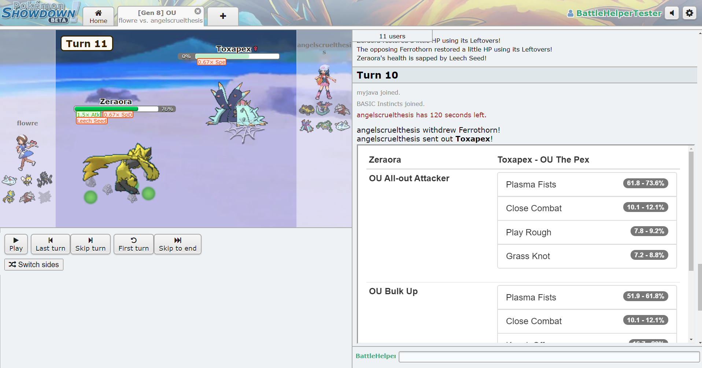

# BattleHelper

This repository provides the code for a Pokémon Showdown Battle helper tool which can analyze replays, look at all teams posted on Smogon and performs damage calcs on every new matchup!

This project is in a **Beta** phase, so use it with the knowledge that it might break!

Any issue or merge request is appreciated.

## Installation

1) Install the Tampermonkey addon here: [Tampermonkey Homepage](https://www.tampermonkey.net/index.php?ext=dhdg)
2) Select the `battleHelper.js` file in this repo found under [Releases](https://github.com/FullLifeGames/BattleHelper/releases)
3) Copy the source
4) Open Tampermonkey in your browser and click the `Add Script` tab (icon with a plus symbol)
5) Paste the source into the script window and hit save

## Usage

When in a battle, click on the `Battle Options` button and then on the `Battle Helper` option.

## Custom Sets

If you want to include your custom sets in the damage calc, visit [my calc copy site](https://fulllifegames.com/Tools/Calc/) and include your sets there!

## Examples

The SmogonDump in action:

The ReplayScouter in action:

The DamageCalc in action:

## Feedback

As previously said, any feedback or bug report is welcomed in the [Issues](https://github.com/FullLifeGames/BattleHelper/issues) tab.   
Currently the UI for the Calc Api window is something I want to work on, so any comments on that would be appreciated.
