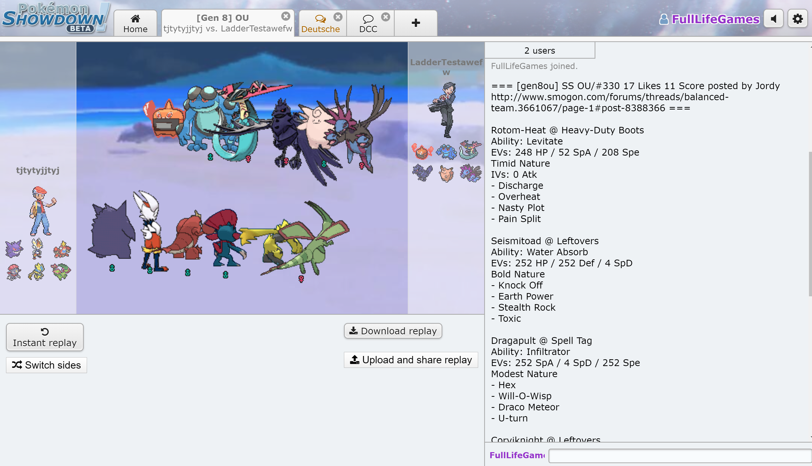
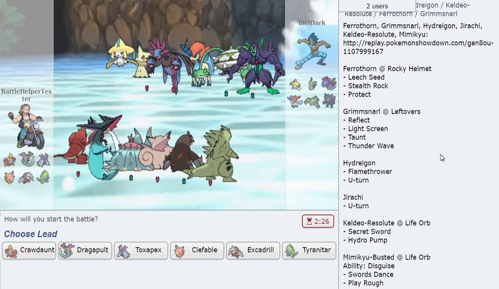

# Pokémon Showdown Battle Helper

This repository provides the code for a Pokémon Showdown Battle helper tool which can analyze replays, look at all teams posted on Smogon and ~~performs damage calcs on every new matchup~~ (use [Showdex](https://www.smogon.com/forums/threads/showdex-an-auto-updating-damage-calculator-built-into-showdown.3707265/)!

This project is in a **Beta** phase, so use it with the knowledge that it might break!

Any issue or merge request is appreciated.

## Installation

1) Install the Tampermonkey addon here: [Tampermonkey Homepage](https://www.tampermonkey.net/index.php?ext=dhdg)
2) Select the `BattleHelper` asset in this repo found under [Releases](https://github.com/FullLifeGames/BattleHelper/releases)
   * This downloads the `battlehelper.js` which contains the source code needed
3) Open the `battlehelper.js` with an editor and copy the source code
4) Open Tampermonkey in your browser and click the `Add Script` tab (icon with a plus symbol)
5) Paste the source into the script window and hit save

## Commands

### Install

```sh
pnpm install
```

### Build

```sh
pnpm build
```

### Lint

```sh
pnpm lint
```

## Usage

When in a battle, click on the `Battle Options` button and then on the `Battle Helper` option.

## Examples

The SmogonDump in action:



The ReplayScouter in action:



## Feedback

As previously said, any feedback or bug report is welcomed in the [Issues](https://github.com/FullLifeGames/BattleHelper/issues) tab.
